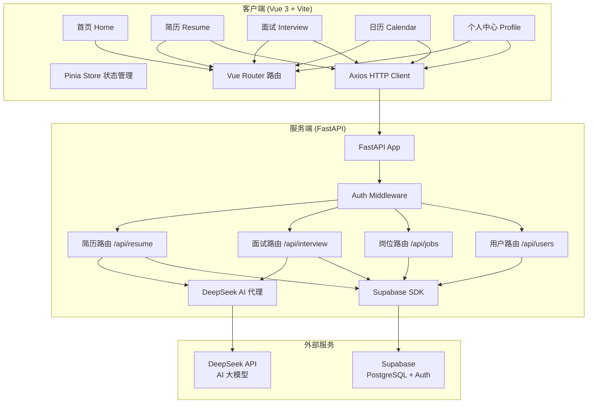
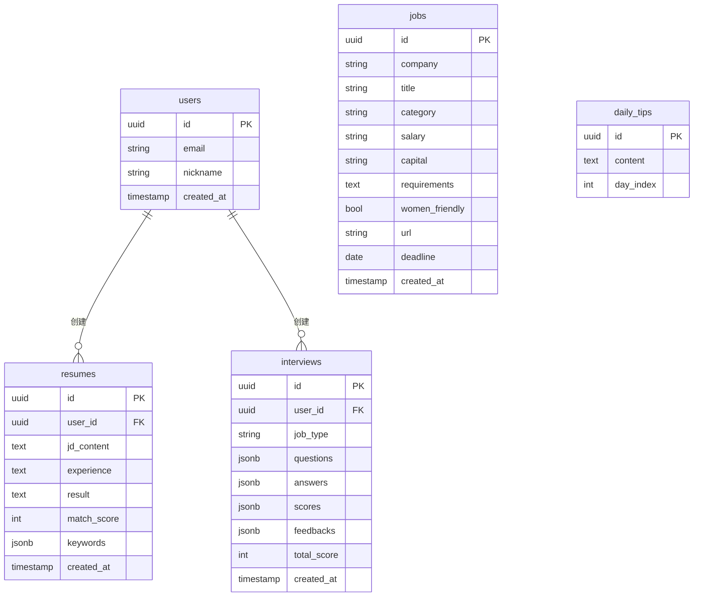
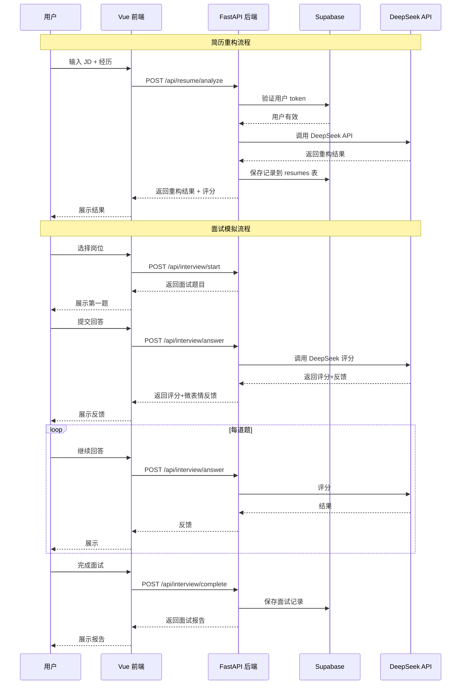

# DESIGN 文档: Offer罗盘系统架构设计

## 1. 整体架构图



## 2. 分层设计

### 2.1 前端分层 (Vue 3 + Vite)

```
src/
├── main.js                    # 入口文件
├── App.vue                    # 根组件（底部导航 + 路由视图）
├── router/
│   └── index.js               # Vue Router 路由配置
├── stores/
│   ├── auth.js                # 用户认证状态 (Pinia)
│   ├── resume.js              # 简历状态
│   ├── interview.js           # 面试状态
│   └── jobs.js                # 岗位数据状态
├── api/
│   ├── client.js              # Axios 实例 + 拦截器
│   ├── auth.js                # 认证 API
│   ├── resume.js              # 简历 API
│   ├── interview.js           # 面试 API
│   └── jobs.js                # 岗位 API
├── views/
│   ├── Home.vue               # 首页
│   ├── Resume.vue             # 简历重构页
│   ├── Interview.vue          # 面试模拟页
│   ├── Calendar.vue           # 招聘日历页
│   └── Profile.vue            # 个人中心页
├── components/
│   ├── BottomNav.vue          # 底部导航栏
│   ├── ResumeForm.vue         # 简历输入表单
│   ├── ResumeResult.vue       # 简历重构结果
│   ├── InterviewStart.vue     # 面试启动（岗位选择）
│   ├── InterviewChat.vue      # 面试聊天区
│   ├── InterviewReport.vue    # 面试报告
│   ├── JobList.vue            # 岗位列表
│   ├── CalendarGrid.vue       # 日历视图
│   ├── JobDetail.vue          # 岗位详情弹窗
│   ├── ModalDialog.vue        # 通用弹窗
│   ├── Toast.vue              # Toast 提示
│   ├── LoadingDots.vue        # 加载动画
│   └── CommunityCard.vue      # 社群卡片
├── composables/
│   └── useToast.js            # Toast 组合式函数
├── utils/
│   └── helpers.js             # 通用工具函数
└── assets/
    └── styles/
        └── main.css           # 全局样式（从原 index.html 迁移）
```

### 2.2 后端分层 (FastAPI)

```
backend/
├── main.py                    # FastAPI 入口
├── config.py                  # 配置管理（环境变量）
├── .env.example               # 环境变量模板
├── requirements.txt           # Python 依赖
├── app/
│   ├── __init__.py
│   ├── auth/
│   │   ├── __init__.py
│   │   └── middleware.py      # Supabase Auth 验证中间件
│   ├── routers/
│   │   ├── __init__.py
│   │   ├── resume.py          # 简历重构接口
│   │   ├── interview.py       # 面试模拟接口
│   │   ├── jobs.py            # 岗位数据接口
│   │   ├── users.py           # 用户数据接口
│   │   └── ai.py              # AI 调用路由
│   ├── services/
│   │   ├── __init__.py
│   │   ├── supabase_service.py    # Supabase 数据库操作
│   │   └── deepseek_service.py    # DeepSeek API 调用
│   ├── models/
│   │   ├── __init__.py
│   │   ├── resume.py          # 简历数据模型
│   │   ├── interview.py       # 面试数据模型
│   │   └── job.py             # 岗位数据模型
│   └── utils/
│       ├── __init__.py
│       └── helpers.py
└── tests/
    ├── __init__.py
    ├── test_resume.py
    ├── test_interview.py
    └── test_jobs.py
```

## 3. 数据库设计 (Supabase/PostgreSQL)

### 3.1 表结构



### 3.2 Supabase SQL 初始化

```sql
-- 简历重构记录
CREATE TABLE resumes (
    id UUID PRIMARY KEY DEFAULT uuid_generate_v4(),
    user_id UUID REFERENCES auth.users(id) NOT NULL,
    jd_content TEXT NOT NULL,
    experience TEXT NOT NULL,
    result TEXT,
    match_score INTEGER,
    keywords JSONB DEFAULT '[]',
    created_at TIMESTAMP WITH TIME ZONE DEFAULT NOW()
);

-- 面试模拟记录
CREATE TABLE interviews (
    id UUID PRIMARY KEY DEFAULT uuid_generate_v4(),
    user_id UUID REFERENCES auth.users(id) NOT NULL,
    job_type VARCHAR(50) NOT NULL,
    questions JSONB NOT NULL,
    answers JSONB DEFAULT '[]',
    scores JSONB DEFAULT '[]',
    feedbacks JSONB DEFAULT '[]',
    total_score INTEGER DEFAULT 0,
    created_at TIMESTAMP WITH TIME ZONE DEFAULT NOW()
);

-- 岗位数据
CREATE TABLE jobs (
    id UUID PRIMARY KEY DEFAULT uuid_generate_v4(),
    company VARCHAR(200) NOT NULL,
    title VARCHAR(200) NOT NULL,
    category VARCHAR(50) NOT NULL,
    salary VARCHAR(50),
    capital VARCHAR(50),
    requirements TEXT,
    women_friendly BOOLEAN DEFAULT false,
    url VARCHAR(500),
    deadline DATE,
    created_at TIMESTAMP WITH TIME ZONE DEFAULT NOW()
);

-- 每日提示
CREATE TABLE daily_tips (
    id UUID PRIMARY KEY DEFAULT uuid_generate_v4(),
    content TEXT NOT NULL,
    day_index INTEGER UNIQUE NOT NULL
);

-- RL S 策略（行级安全）
ALTER TABLE resumes ENABLE ROW LEVEL SECURITY;
ALTER TABLE interviews ENABLE ROW LEVEL SECURITY;
ALTER TABLE jobs ENABLE ROW LEVEL SECURITY;

CREATE POLICY "Users can only view their own resumes"
    ON resumes FOR ALL
    USING (auth.uid() = user_id);

CREATE POLICY "Users can only view their own interviews"
    ON interviews FOR ALL
    USING (auth.uid() = user_id);

CREATE POLICY "Jobs are public read"
    ON jobs FOR SELECT
    TO authenticated, anon
    USING (true);
```

## 4. API 接口契约

### 4.1 认证接口

| 方法 | 路径 | 说明 | 认证 |
|------|------|------|------|
| POST | /api/auth/signup | 注册 | 否 |
| POST | /api/auth/login | 登录 | 否 |
| POST | /api/auth/logout | 登出 | 是 |
| GET  | /api/auth/me | 获取当前用户 | 是 |

### 4.2 简历接口

| 方法 | 路径 | 说明 | 认证 |
|------|------|------|------|
| POST   | /api/resume/analyze | AI简历重构分析 | 是 |
| GET    | /api/resume/history | 获取重构历史 | 是 |
| GET    | /api/resume/{id}    | 获取单条记录 | 是 |

**POST /api/resume/analyze**
```json
// Request
{ "jd_content": "岗位描述...", "experience": "我的经历..." }
// Response
{
  "id": "uuid",
  "result": "重构后的简历内容...",
  "match_score": 85,
  "keywords": [
    { "word": "ROS", "matched": true },
    { "word": "SLAM", "matched": true }
  ]
}
```

### 4.3 面试接口

| 方法 | 路径 | 说明 | 认证 |
|------|------|------|------|
| POST   | /api/interview/start   | 开始面试（获取题目） | 是 |
| POST   | /api/interview/answer  | 提交回答并评分 | 是 |
| POST   | /api/interview/complete | 完成面试生成报告 | 是 |
| GET    | /api/interview/history | 获取面试历史 | 是 |

### 4.4 岗位接口

| 方法 | 路径 | 说明 | 认证 |
|------|------|------|------|
| GET  | /api/jobs        | 获取岗位列表（支持筛选） | 否 |
| GET  | /api/jobs/{id}   | 获取岗位详情 | 否 |

### 4.5 工具接口

| 方法 | 路径 | 说明 | 认证 |
|------|------|------|------|
| GET  | /api/tips/today  | 获取今日提示 | 否 |
| GET  | /api/stats/mine  | 获取用户统计 | 是 |

## 5. 数据流向图



## 6. 异常处理策略

### 6.1 前端异常处理
1. **网络错误**: Axios 拦截器统一处理，显示 Toast 提示
2. **认证过期**: 401 响应时自动跳转登录页
3. **AI 超时**: 前端设置 30s 超时，提示"AI 服务繁忙"
4. **输入验证**: 前端表单校验，非空/长度校验

### 6.2 后端异常处理
1. **全局异常处理器**: FastAPI 统一异常捕获
2. **Supabase 异常**: 数据库操作异常封装
3. **DeepSeek API 异常**: API 调用异常降级（返回结构化错误）
4. **认证异常**: Token 过期/无效返回 401

### 6.3 错误响应格式
```json
{
  "detail": "错误描述",
  "code": "ERROR_CODE",
  "timestamp": "2026-05-12T10:00:00Z"
}
```

## 7. 环境变量配置

### 前端 (.env)
```
VITE_API_BASE_URL=http://localhost:8000/api
VITE_SUPABASE_URL=your_supabase_url
VITE_SUPABASE_ANON_KEY=your_supabase_anon_key
```

### 后端 (.env)
```
SUPABASE_URL=your_supabase_url
SUPABASE_SERVICE_ROLE_KEY=your_service_role_key
DEEPSEEK_API_KEY=your_deepseek_api_key
DEEPSEEK_API_BASE=https://api.deepseek.com/v1
CORS_ORIGINS=http://localhost:5173
```

## 8. 项目进度

```
项目启动 → [Phase 1] 创建前端项目框架 (Vue3+Vite+Router+Pinia)
         → [Phase 2] 创建后端项目框架 (FastAPI+配置+依赖)
         → [Phase 3] Supabase 数据库初始化（表创建+种子数据）
         → [Phase 4] 后端 API 路由实现（简历+面试+岗位+用户）
         → [Phase 5] DeepSeek AI 集成（简历重构+面试评分）
         → [Phase 6] 前端组件化改造（保留原UI风格）
         → [Phase 7] 前端-后端 API 对接
         → [Phase 8] 认证系统集成（登录/注册）
         → [Phase 9] 测试与质量验收
```