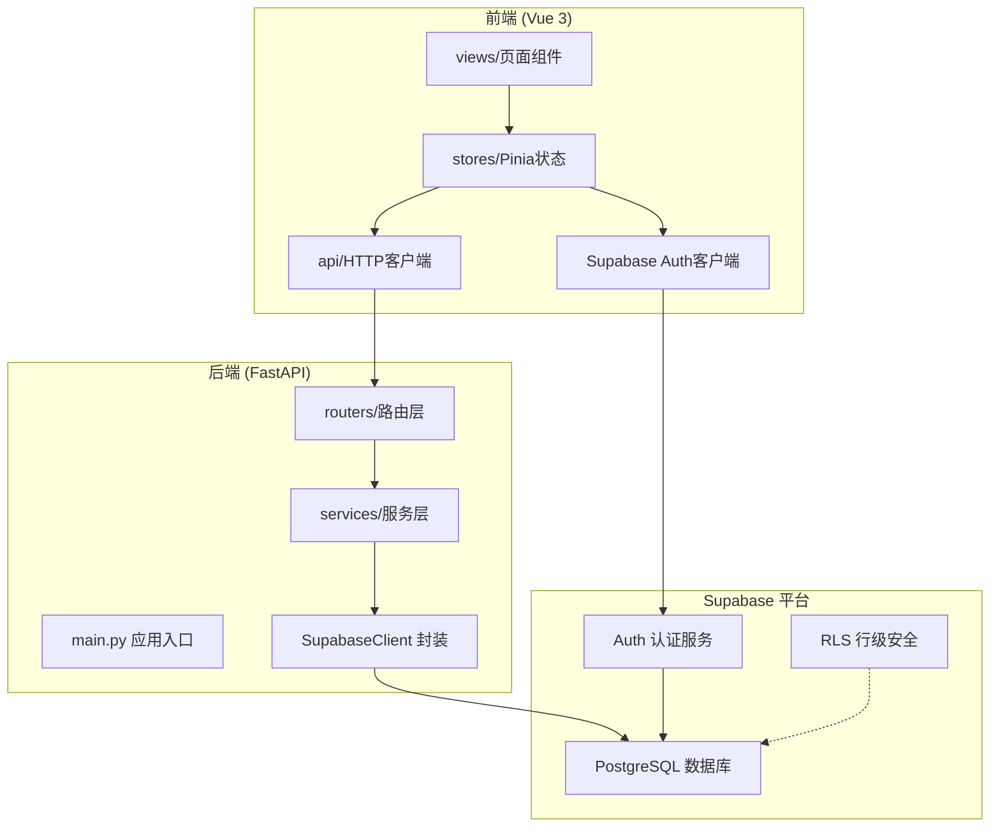
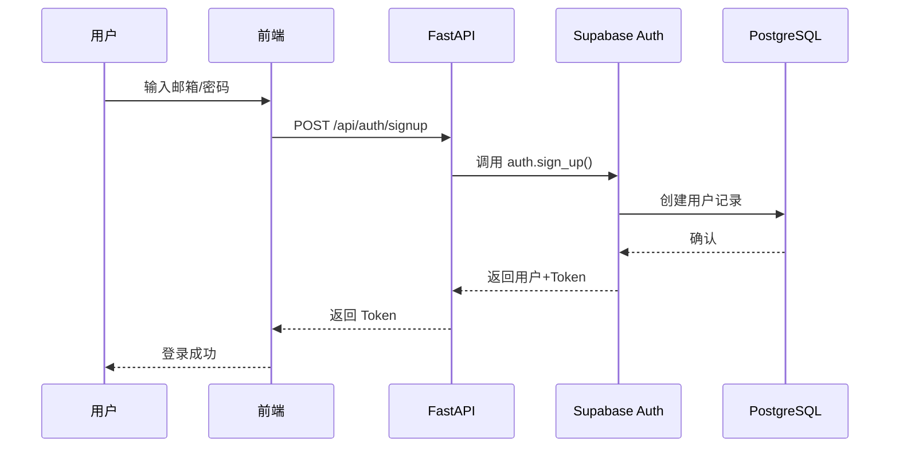
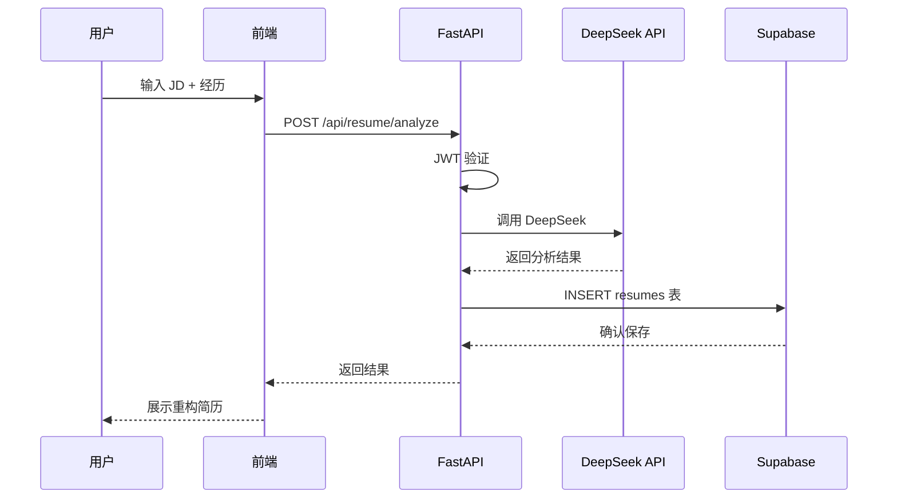

# DESIGN 文档: Supabase 数据库集成架构设计

## 1. 整体架构图



## 2. 分层设计

### 2.1 后端分层

```
backend/
├── main.py                      # FastAPI 入口，注册路由
├── config.py                    # 配置管理（Supabase URL/Key）
├── requirements.txt             # 新增 supabase-py 依赖
├── .env                         # 环境变量（SUPABASE_URL, SUPABASE_SERVICE_KEY）
└── app/
    ├── __init__.py
    ├── auth/
    │   ├── __init__.py
    │   └── supabase_auth.py     # Supabase Auth 集成
    ├── routers/
    │   ├── __init__.py
    │   ├── resume.py            # 简历路由（改用 Supabase 查询）
    │   ├── interview.py         # 面试路由（改用 Supabase 查询）
    │   ├── jobs.py              # 岗位路由（改用 Supabase 查询）
    │   └── auth_routes.py       # 认证路由（改用 Supabase Auth）
    ├── services/
    │   ├── __init__.py
    │   ├── supabase_client.py   # Supabase 客户端封装
    │   ├── resume_service.py    # 简历业务逻辑
    │   ├── interview_service.py # 面试业务逻辑
    │   └── job_service.py       # 岗位业务逻辑
    └── models/
        ├── __init__.py
        └── schemas.py           # Pydantic 模型（保持现有）
```

### 2.2 核心组件设计

#### SupabaseClient 封装

```python
# app/services/supabase_client.py
from supabase import create_client, Client
from config import settings

class SupabaseClient:
    _instance: Client = None
    
    @classmethod
    def get_client(cls) -> Client:
        if cls._instance is None:
            cls._instance = create_client(
                settings.SUPABASE_URL,
                settings.SUPABASE_SERVICE_KEY
            )
        return cls._instance

# 快捷函数
def get_supabase() -> Client:
    return SupabaseClient.get_client()
```

#### 服务层模式

```python
# app/services/job_service.py
from app.services.supabase_client import get_supabase

class JobService:
    @staticmethod
    def get_jobs(category: str = "all"):
        supabase = get_supabase()
        query = supabase.table("jobs").select("*")
        if category != "all":
            query = query.eq("category", category)
        result = query.execute()
        return result.data
    
    @staticmethod
    def get_job_by_id(job_id: int):
        supabase = get_supabase()
        result = supabase.table("jobs").select("*").eq("id", job_id).single().execute()
        return result.data
```

## 3. 数据库设计（复用现有 DESIGN）

### 3.1 表结构

```sql
-- 启用 UUID 扩展
CREATE EXTENSION IF NOT EXISTS "uuid-ossp";

-- 用户表（由 Supabase Auth 管理，但我们可扩展）
CREATE TABLE IF NOT EXISTS public.users (
    id UUID PRIMARY KEY REFERENCES auth.users(id),
    email TEXT UNIQUE NOT NULL,
    nickname TEXT,
    created_at TIMESTAMP WITH TIME ZONE DEFAULT NOW()
);

-- 简历重构记录表
CREATE TABLE IF NOT EXISTS public.resumes (
    id UUID PRIMARY KEY DEFAULT uuid_generate_v4(),
    user_id UUID REFERENCES auth.users(id) NOT NULL,
    jd_content TEXT NOT NULL,
    experience TEXT NOT NULL,
    result TEXT,
    match_score INTEGER,
    keywords JSONB DEFAULT '[]',
    created_at TIMESTAMP WITH TIME ZONE DEFAULT NOW()
);

-- 面试模拟记录表
CREATE TABLE IF NOT EXISTS public.interviews (
    id UUID PRIMARY KEY DEFAULT uuid_generate_v4(),
    user_id UUID REFERENCES auth.users(id) NOT NULL,
    job_type VARCHAR(50) NOT NULL,
    questions JSONB NOT NULL,
    answers JSONB DEFAULT '[]',
    scores JSONB DEFAULT '[]',
    feedbacks JSONB DEFAULT '[]',
    total_score INTEGER DEFAULT 0,
    created_at TIMESTAMP WITH TIME ZONE DEFAULT NOW()
);

-- 岗位数据表
CREATE TABLE IF NOT EXISTS public.jobs (
    id SERIAL PRIMARY KEY,
    company VARCHAR(200) NOT NULL,
    title VARCHAR(200) NOT NULL,
    category VARCHAR(50) NOT NULL,
    salary VARCHAR(50),
    capital VARCHAR(50),
    requirements TEXT,
    women_friendly BOOLEAN DEFAULT false,
    url VARCHAR(500),
    deadline DATE,
    created_at TIMESTAMP WITH TIME ZONE DEFAULT NOW()
);

-- 每日提示表
CREATE TABLE IF NOT EXISTS public.daily_tips (
    id SERIAL PRIMARY KEY,
    content TEXT NOT NULL,
    day_index INTEGER UNIQUE NOT NULL
);
```

### 3.2 RLS 策略

```sql
-- 简历表：用户只能访问自己的数据
ALTER TABLE public.resumes ENABLE ROW LEVEL SECURITY;

CREATE POLICY "Users can only access their own resumes"
    ON public.resumes
    FOR ALL
    USING (auth.uid() = user_id);

-- 面试表：用户只能访问自己的数据
ALTER TABLE public.interviews ENABLE ROW LEVEL SECURITY;

CREATE POLICY "Users can only access their own interviews"
    ON public.interviews
    FOR ALL
    USING (auth.uid() = user_id);

-- 岗位表：公开读取
ALTER TABLE public.jobs ENABLE ROW LEVEL SECURITY;

CREATE POLICY "Jobs are publicly readable"
    ON public.jobs
    FOR SELECT
    TO authenticated, anon
    USING (true);

-- 提示表：公开读取
ALTER TABLE public.daily_tips ENABLE ROW LEVEL SECURITY;

CREATE POLICY "Tips are publicly readable"
    ON public.daily_tips
    FOR SELECT
    TO authenticated, anon
    USING (true);
```

## 4. API 接口契约（保持向后兼容）

### 4.1 认证接口

| 方法 | 路径 | 说明 | 变更 |
|------|------|------|------|
| POST | /api/auth/signup | 注册 | 改用 Supabase Auth |
| POST | /api/auth/login | 登录 | 改用 Supabase Auth |
| POST | /api/auth/logout | 登出 | 改用 Supabase Auth |
| GET | /api/auth/me | 获取当前用户 | 改用 Supabase Auth |

### 4.2 业务接口（保持不变）

| 方法 | 路径 | 说明 |
|------|------|------|
| POST | /api/resume/analyze | AI简历分析 |
| GET | /api/resume/history | 获取简历历史 |
| POST | /api/interview/start | 开始面试 |
| POST | /api/interview/answer | 提交答案 |
| POST | /api/interview/complete | 完成面试 |
| GET | /api/jobs | 获取岗位列表 |
| GET | /api/jobs/{id} | 获取岗位详情 |
| GET | /api/tips/today | 获取今日提示 |

## 5. 数据流向图

### 5.1 用户注册/登录流程



### 5.2 简历分析流程



## 6. 异常处理策略

### 6.1 数据库连接异常

```python
# 封装重试机制
try:
    result = supabase.table("jobs").select("*").execute()
except Exception as e:
    logger.error(f"Supabase query failed: {e}")
    raise HTTPException(
        status_code=503,
        detail="数据库服务暂时不可用"
    )
```

### 6.2 认证异常

```python
# Supabase Auth 异常映射
try:
    user = supabase.auth.sign_in_with_password({"email": email, "password": password})
except AuthApiError as e:
    if e.message == "Invalid login credentials":
        raise HTTPException(status_code=401, detail="邮箱或密码错误")
    raise HTTPException(status_code=400, detail=e.message)
```

## 7. 环境变量配置

### 7.1 后端 `.env`

```env
# Supabase 配置
SUPABASE_URL=https://your-project.supabase.co
SUPABASE_SERVICE_KEY=your-supabase-service-role-key

# DeepSeek AI 配置（已有）
DEEPSEEK_API_KEY=your-deepseek-api-key
DEEPSEEK_API_URL=https://api.deepseek.com/v1/chat/completions

# JWT 配置（可选，如果用 Supabase Auth 可移除）
API_SECRET_KEY=your-secret-key
```

### 7.2 前端 `.env`

```env
VITE_API_BASE_URL=http://localhost:8000/api
VITE_SUPABASE_URL=https://your-project.supabase.co
VITE_SUPABASE_ANON_KEY=your-supabase-publishable-key
```

## 8. 依赖变更

### 8.1 后端 requirements.txt 新增

```
supabase>=2.0.0
```

### 8.2 前端 package.json 新增

```bash
npm install @supabase/supabase-js
```

---

**设计完成日期**: 2026-05-19
**架构评审通过**: ✅
