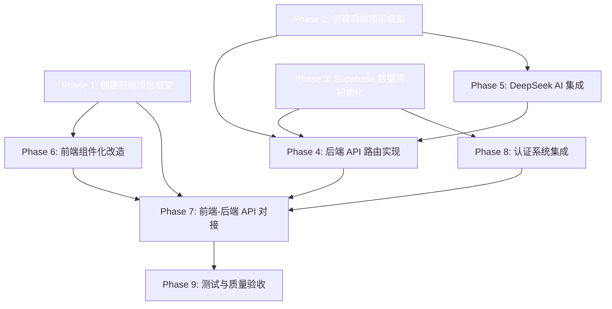

# TASK 文档: Offer罗盘原子任务拆分

## 任务依赖关系图

---

## Phase 1: 创建前端项目框架

### 输入契约
- **前置依赖**: 无
- **输入数据**: 设计要求（DESIGN 文档）
- **环境依赖**: Node.js >= 18, pnpm >= 8

### 输出契约
- **交付物**: Vue 3 + Vite 项目骨架（含路由、状态管理、API 客户端、目录结构）
- **验收标准**:
  - [ ] `pnpm dev` 启动开发服务器
  - [ ] 页面路由正常工作（5个页面可访问）
  - [ ] Pinia store 可正常读写
  - [ ] Axios 实例可正常发送请求

### 实现约束
- 使用 Vue 3 Composition API + `<script setup>`
- 使用 Pinia 替代 Vuex
- 使用 Vue Router 4 hash 模式
- 包管理器使用 pnpm

### 具体任务
1. 创建项目目录结构
2. 初始化 Vite + Vue 3 项目
3. 安装依赖（vue-router, pinia, axios, @supabase/supabase-js）
4. 配置 main.js（注册路由、Pinia）
5. 创建 App.vue（根布局 + 底部导航）
6. 配置 router/index.js（5个页面路由）
7. 创建 api/client.js（Axios 实例 + 拦截器）
8. 创建 stores/auth.js, resume.js, interview.js, jobs.js
9. 创建 utils/helpers.js
10. 创建 composables/useToast.js
11. 创建 assets/styles/main.css（迁移原样式）
12. 配置 vite.config.js（代理到后端）
13. 配置 .env 文件

---

## Phase 2: 创建后端项目框架

### 输入契约
- **前置依赖**: 无
- **输入数据**: 设计要求
- **环境依赖**: Python >= 3.10, pip

### 输出契约
- **交付物**: FastAPI 项目骨架（含配置、依赖、目录结构）
- **验收标准**:
  - [ ] `uvicorn main:app --reload` 启动服务
  - [ ] 访问 `/docs` 显示 Swagger 文档
  - [ ] 健康检查接口返回正常

### 实现约束
- 使用 FastAPI 异步框架
- 使用 pydantic 数据验证
- 环境变量使用 python-dotenv 管理

### 具体任务
1. 创建 backend/ 目录结构
2. 创建 requirements.txt（fastapi, uvicorn, python-dotenv, httpx, supabase）
3. 创建 config.py（环境变量配置类）
4. 创建 main.py（FastAPI 应用入口）
5. 创建 .env.example
6. 创建 app/__init__.py
7. 创建 app/auth/__init__.py + middleware.py
8. 创建 app/routers/__init__.py
9. 创建 app/services/__init__.py
10. 创建 app/models/__init__.py
11. 创建 app/utils/__init__.py + helpers.py

---

## Phase 3: Supabase 数据库初始化

### 输入契约
- **前置依赖**: Phase 2（后端框架就绪）
- **输入数据**: Supabase 项目创建 + 数据库 schema
- **环境依赖**: Supabase 账号

### 输出契约
- **交付物**: Supabase 项目 + 表结构 + 种子数据 + RLS 策略
- **验收标准**:
  - [ ] 所有表在 Supabase SQL Editor 中创建成功
  - [ ] 种子数据（岗位12条 + 每日提示8条）插入成功
  - [ ] RLS 策略创建成功
  - [ ] 后端可连接 Supabase 并查询数据

### 具体任务
1. 创建 SQL 迁移脚本（表创建）
2. 创建种子数据 SQL（岗位 + 每日提示）
3. 创建 RLS 策略 SQL
4. 创建 `app/services/supabase_service.py`（Supabase 客户端封装）
5. 创建数据模型 models（pydantic 模型）
6. API Key 安全配置说明

---

## Phase 4: 后端 API 路由实现

### 输入契约
- **前置依赖**: Phase 2, Phase 3
- **输入数据**: API 接口契约
- **环境依赖**: Supabase 连接正常

### 输出契约
- **交付物**: 所有 REST API 路由（简历、面试、岗位、用户、工具接口）
- **验收标准**:
  - [ ] 每个接口返回正确的 HTTP 状态码
  - [ ] 请求/响应符合接口契约
  - [ ] 认证中间件正确拦截未授权请求
  - [ ] Swagger 文档完整展示所有接口

### 具体任务
1. 创建 `app/routers/resume.py`（简历重构 + 历史记录接口）
2. 创建 `app/routers/interview.py`（面试开始 + 答题 + 完成接口）
3. 创建 `app/routers/jobs.py`（岗位列表 + 详情接口）
4. 创建 `app/routers/users.py`（用户统计接口）
5. 创建 `app/routers/auth_routes.py`（认证代理接口）
6. 在 main.py 中注册所有路由

---

## Phase 5: DeepSeek AI 集成

### 输入契约
- **前置依赖**: Phase 2
- **输入数据**: DeepSeek API Key + API 规范
- **环境依赖**: DeepSeek API 可访问

### 输出契约
- **交付物**: AI 服务层（简历重构 + 面试评分 + 面试报告）
- **验收标准**:
  - [ ] 简历重构调用成功，返回结构化结果
  - [ ] 面试评分调用成功，返回评分+反馈
  - [ ] 异常时返回友好的降级响应
  - [ ] API Key 不暴露在前端

### 具体任务
1. 创建 `app/services/deepseek_service.py`
   - `analyze_resume(jd, experience)` — 简历重构
   - `evaluate_answer(question, answer)` — 面试评分
   - `generate_report(questions, answers, scores)` — 生成面试报告
2. 简历重构 Prompt 工程
3. 面试评分 Prompt 工程
4. 错误处理和降级策略
5. 创建 `app/routers/ai.py`（AI 代理路由）

---

## Phase 6: 前端组件化改造

### 输入契约
- **前置依赖**: Phase 1（前端框架就绪）
- **输入数据**: 现有 index.html 的 UI 设计和交互逻辑
- **环境依赖**: Vite 开发服务器

### 输出契约
- **交付物**: 所有 Vue 组件（视图页 + 可复用组件）
- **验收标准**:
  - [ ] 5个页面视图均可正常渲染
  - [ ] 所有交互功能与原有 index.html 一致
  - [ ] 组件可独立使用，props/emit 定义清晰
  - [ ] 样式与原有设计完全一致

### 具体任务
1. 迁移全局样式到 `assets/styles/main.css`
2. 创建 `views/Home.vue`（首页视图）
3. 创建 `views/Resume.vue`（简历重构视图，组合 ResumeForm + ResumeResult）
4. 创建 `views/Interview.vue`（面试模拟视图，组合 InterviewStart + InterviewChat + InterviewReport）
5. 创建 `views/Calendar.vue`（招聘日历视图，组合 JobList + CalendarGrid）
6. 创建 `views/Profile.vue`（个人中心视图）
7. 创建 `components/BottomNav.vue`（底部导航）
8. 创建 `components/ResumeForm.vue`（简历输入表单）
9. 创建 `components/ResumeResult.vue`（简历重构结果展示）
10. 创建 `components/InterviewStart.vue`（面试启动 - 岗位选择）
11. 创建 `components/InterviewChat.vue`（面试聊天区域）
12. 创建 `components/InterviewReport.vue`（面试报告）
13. 创建 `components/JobList.vue`（岗位列表视图）
14. 创建 `components/CalendarGrid.vue`（日历网格视图）
15. 创建 `components/JobDetail.vue`（岗位详情弹窗）
16. 创建 `components/ModalDialog.vue`（通用弹窗组件）
17. 创建 `components/Toast.vue`（Toast 提示组件）
18. 创建 `components/LoadingDots.vue`（加载动画组件）
19. 创建 `components/CommunityCard.vue`（社群卡片组件）
20. 状态逻辑从组件迁移到 Pinia stores
21. 添加组件间交互（props/emit）

---

## Phase 7: 前端-后端 API 对接

### 输入契约
- **前置依赖**: Phase 4, Phase 6
- **输入数据**: 后端 API 接口 + 前端 API 客户端
- **环境依赖**: 后端服务运行中

### 输出契约
- **交付物**: 前端所有 API 调用代码（含请求/响应处理、错误处理、加载状态）
- **验收标准**:
  - [ ] 简历重构功能从真实后端获取数据
  - [ ] 面试模拟功能从真实后端获取数据
  - [ ] 岗位数据从 Supabase 获取
  - [ ] 认证流程正常工作
  - [ ] 错误状态在前端正确处理

### 具体任务
1. 完善 `api/resume.js`（对接后端简历接口）
2. 完善 `api/interview.js`（对接后端面试接口）
3. 完善 `api/jobs.js`（对接后端岗位接口）
4. 完善 `api/auth.js`（对接后端认证接口）
5. 在 views 中移除 Mock 逻辑，替换为真实 API 调用
6. 添加 loading 状态和错误处理
7. 实现 Axios 响应拦截器（401 自动跳转登录）

---

## Phase 8: 认证系统集成

### 输入契约
- **前置依赖**: Phase 1, Phase 3
- **输入数据**: Supabase Auth 配置
- **环境依赖**: Supabase 项目已创建

### 输出契约
- **交付物**: 完整的用户认证流程（注册/登录/登出/路由守卫）
- **验收标准**:
  - [ ] 用户可注册新账号
  - [ ] 用户可登录/登出
  - [ ] 未登录用户自动跳转到登录页
  - [ ] 登录状态跨页面保持
  - [ ] Token 自动刷新

### 具体任务
1. 创建登录/注册页面 `views/Auth.vue`
2. 完善 `stores/auth.js`（Supabase Auth 集成）
3. 实现路由守卫（未登录重定向）
4. 实现 Token 自动管理
5. 更新底部导航（登录用户显示个人信息）

---

## Phase 9: 测试与质量验收

### 输入契约
- **前置依赖**: Phase 7, Phase 8
- **输入数据**: 完整项目代码

### 输出契约
- **交付物**: 测试代码 + 验收报告
- **验收标准**:
  - [ ] 前端单元测试覆盖率 > 60%
  - [ ] 后端接口测试覆盖所有路由
  - [ ] 项目编译无错误
  - [ ] 所有核心功能端到端可用

### 具体任务
1. 前端：安装 Vitest，编写组件测试
2. 后端：安装 pytest + httpx，编写接口测试
3. 运行全量测试
4. 修复问题
5. 编译构建前端
6. 生成 ACCEPTANCE 文档