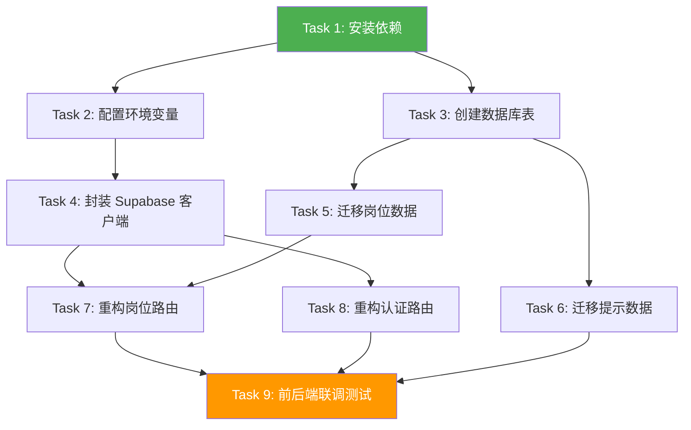

# TASK 文档: Supabase 数据库集成原子任务

## 任务依赖关系图



---

## Task 1: 安装 Supabase 依赖

### 输入契约
- **前置依赖**: 无
- **环境依赖**: Python >= 3.10, pip

### 输出契约
- **交付物**: 更新后的 requirements.txt，后端可导入 supabase
- **验收标准**:
  - [ ] `pip install supabase` 成功
  - [ ] `python -c "from supabase import create_client"` 无错误

### 实现约束
- 使用 supabase-py >= 2.0.0
- 保持向后兼容，不影响现有依赖

### 具体步骤
1. 编辑 `backend/requirements.txt`，添加 `supabase>=2.0.0`
2. 执行 `pip install -r requirements.txt`
3. 验证安装成功

---

## Task 2: 配置环境变量

### 输入契约
- **前置依赖**: Task 1
- **输入数据**: Supabase URL 和 service_role key

### 输出契约
- **交付物**: 更新后的 `.env` 文件，后端可读取配置
- **验收标准**:
  - [ ] `.env` 文件包含 SUPABASE_URL 和 SUPABASE_SERVICE_KEY
  - [ ] 后端代码可通过 `os.getenv` 读取到值
  - [ ] 敏感信息不提交到 Git（.gitignore 已配置）

### 实现约束
- 使用 python-dotenv 加载环境变量
- 提供默认值或明确报错

### 具体步骤
1. 创建 `backend/config.py` 配置类
2. 更新 `backend/.env` 添加 Supabase 配置
3. 验证配置读取正常

---

## Task 3: 创建数据库表和 RLS 策略

### 输入契约
- **前置依赖**: Task 2
- **环境依赖**: Supabase 项目可访问

### 输出契约
- **交付物**: Supabase 中创建所有表和策略
- **验收标准**:
  - [ ] 5 张表创建成功（users, resumes, interviews, jobs, daily_tips）
  - [ ] RLS 策略启用并配置正确
  - [ ] 可通过 Supabase SQL Editor 查看表结构

### 实现约束
- 使用 SQL 迁移脚本
- 启用 uuid-ossp 扩展
- 遵循现有 DESIGN 文档的数据结构

### 具体步骤
1. 登录 Supabase Dashboard → SQL Editor
2. 执行 `database/init_tables.sql`（见下方 SQL）
3. 验证表创建成功

### SQL 脚本
```sql
-- 启用 UUID 扩展
CREATE EXTENSION IF NOT EXISTS "uuid-ossp";

-- 用户扩展表
CREATE TABLE IF NOT EXISTS public.users (
    id UUID PRIMARY KEY REFERENCES auth.users(id),
    email TEXT UNIQUE NOT NULL,
    nickname TEXT,
    created_at TIMESTAMP WITH TIME ZONE DEFAULT NOW()
);

-- 简历表
CREATE TABLE IF NOT EXISTS public.resumes (
    id UUID PRIMARY KEY DEFAULT uuid_generate_v4(),
    user_id UUID REFERENCES auth.users(id) NOT NULL,
    jd_content TEXT NOT NULL,
    experience TEXT NOT NULL,
    result TEXT,
    match_score INTEGER,
    keywords JSONB DEFAULT '[]',
    created_at TIMESTAMP WITH TIME ZONE DEFAULT NOW()
);

-- 面试表
CREATE TABLE IF NOT EXISTS public.interviews (
    id UUID PRIMARY KEY DEFAULT uuid_generate_v4(),
    user_id UUID REFERENCES auth.users(id) NOT NULL,
    job_type VARCHAR(50) NOT NULL,
    questions JSONB NOT NULL,
    answers JSONB DEFAULT '[]',
    scores JSONB DEFAULT '[]',
    feedbacks JSONB DEFAULT '[]',
    total_score INTEGER DEFAULT 0,
    created_at TIMESTAMP WITH TIME ZONE DEFAULT NOW()
);

-- 岗位表
CREATE TABLE IF NOT EXISTS public.jobs (
    id SERIAL PRIMARY KEY,
    company VARCHAR(200) NOT NULL,
    title VARCHAR(200) NOT NULL,
    category VARCHAR(50) NOT NULL,
    salary VARCHAR(50),
    capital VARCHAR(50),
    requirements TEXT,
    women_friendly BOOLEAN DEFAULT false,
    url VARCHAR(500),
    deadline DATE,
    created_at TIMESTAMP WITH TIME ZONE DEFAULT NOW()
);

-- 提示表
CREATE TABLE IF NOT EXISTS public.daily_tips (
    id SERIAL PRIMARY KEY,
    content TEXT NOT NULL,
    day_index INTEGER UNIQUE NOT NULL
);

-- RLS 策略
ALTER TABLE public.resumes ENABLE ROW LEVEL SECURITY;
ALTER TABLE public.interviews ENABLE ROW LEVEL SECURITY;
ALTER TABLE public.jobs ENABLE ROW LEVEL SECURITY;
ALTER TABLE public.daily_tips ENABLE ROW LEVEL SECURITY;

CREATE POLICY "Users can only access their own resumes"
    ON public.resumes FOR ALL USING (auth.uid() = user_id);

CREATE POLICY "Users can only access their own interviews"
    ON public.interviews FOR ALL USING (auth.uid() = user_id);

CREATE POLICY "Jobs are publicly readable"
    ON public.jobs FOR SELECT TO authenticated, anon USING (true);

CREATE POLICY "Tips are publicly readable"
    ON public.daily_tips FOR SELECT TO authenticated, anon USING (true);
```

---

## Task 4: 封装 Supabase 客户端

### 输入契约
- **前置依赖**: Task 2
- **输入数据**: config.py 配置

### 输出契约
- **交付物**: `app/services/supabase_client.py`
- **验收标准**:
  - [ ] 单例模式封装
  - [ ] 可通过 `get_supabase()` 获取客户端
  - [ ] 连接失败时抛出清晰错误

### 实现约束
- 使用单例模式避免重复创建连接
- 异常处理完善

### 具体步骤
1. 创建 `backend/app/services/supabase_client.py`
2. 实现 SupabaseClient 类
3. 编写简单测试验证连接

---

## Task 5: 迁移岗位种子数据

### 输入契约
- **前置依赖**: Task 3
- **输入数据**: main.py 中的 JOBS_DATA

### 输出契约
- **交付物**: Supabase jobs 表中有 12 条记录
- **验收标准**:
  - [ ] 12 个岗位数据插入成功
  - [ ] 可通过 Supabase 表编辑器查看

### 实现约束
- 保持数据与现有 JOBS_DATA 一致
- 处理重复插入（幂等）

### 具体步骤
1. 编写 `database/seed_jobs.sql`
2. 在 Supabase SQL Editor 执行
3. 验证数据插入

---

## Task 6: 迁移每日提示种子数据

### 输入契约
- **前置依赖**: Task 3
- **输入数据**: main.py 中的 TIPS_DATA

### 输出契约
- **交付物**: Supabase daily_tips 表中有 8 条记录
- **验收标准**:
  - [ ] 8 条提示数据插入成功

### 具体步骤
1. 编写 `database/seed_tips.sql`
2. 在 Supabase SQL Editor 执行
3. 验证数据插入

---

## Task 7: 重构岗位路由使用真实数据

### 输入契约
- **前置依赖**: Task 4, Task 5
- **输入数据**: 现有 routers/jobs.py 或 main.py 中的路由

### 输出契约
- **交付物**: 更新后的岗位路由，从 Supabase 查询
- **验收标准**:
  - [ ] GET /api/jobs 返回 Supabase 数据
  - [ ] GET /api/jobs/{id} 返回单条记录
  - [ ] 支持 category 筛选
  - [ ] API 响应格式与之前一致

### 实现约束
- 保持 API 契约不变
- 错误处理完善

### 具体步骤
1. 创建 `backend/app/services/job_service.py`
2. 创建 `backend/app/routers/jobs.py`
3. 更新 `main.py` 移除假数据，使用 service 层

---

## Task 8: 重构认证路由使用 Supabase Auth

### 输入契约
- **前置依赖**: Task 4
- **输入数据**: 现有认证路由逻辑

### 输出契约
- **交付物**: 更新后的认证路由，使用 Supabase Auth
- **验收标准**:
  - [ ] POST /api/auth/signup 调用 Supabase 注册
  - [ ] POST /api/auth/login 调用 Supabase 登录
  - [ ] GET /api/auth/me 返回当前用户信息
  - [ ] JWT Token 格式与之前兼容

### 实现约束
- 保持 Token 响应格式
- 错误消息友好

### 具体步骤
1. 创建 `backend/app/auth/supabase_auth.py`
2. 更新 `backend/app/routers/auth_routes.py`
3. 更新 `main.py` 使用新的认证方式

---

## Task 9: 前后端联调测试

### 输入契约
- **前置依赖**: Task 7, Task 8
- **环境依赖**: 前后端服务都启动

### 输出契约
- **交付物**: 测试通过的验证报告
- **验收标准**:
  - [ ] 前端可正常获取岗位列表
  - [ ] 用户可注册/登录
  - [ ] 简历分析功能正常
  - [ ] 面试功能正常
  - [ ] 无控制台错误

### 具体步骤
1. 启动后端 `python main.py`
2. 启动前端 `npm run dev`
3. 逐个功能点测试
4. 记录问题并修复

---

## 执行建议

### 并行任务
- Task 5 和 Task 6 可并行（独立的数据插入）
- Task 7 和 Task 8 可并行（独立的路由模块）

### 关键路径
Task 1 → Task 2 → Task 3 → Task 4 → (Task 5, Task 6, Task 7, Task 8) → Task 9

---

**任务拆分完成**: 2026-05-19
**总任务数**: 9
**预估总耗时**: 2-3 小时
